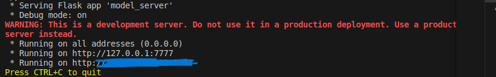
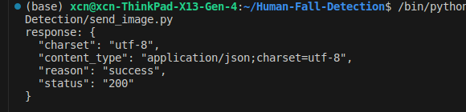
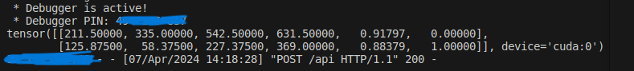

# DeepLearning-with-Flask-beginner
使用flask部署深度学习模型的一个简单演示。
## 文件说明
* weights文件下存放训练好的模型权重，这里用的是yolov5模型
* model_server.py用于开启flask服务，从而接受用户发起的请求（比如上传图片）
* send_request.py用于发起请求（这里以上传图片为例）

## 使用说明
1. 在model_server.py中的load_model()函数中修改模型权重文件的路径，然后运行，如下

2. 在send_request.py中修改需要发送的图像路径，修改服务器ip（1中开启的），然后运行, 如下

发送图片和运行结果如下：
发送的图片含有两个人，服务器中部署的模型推理出人员跌倒检测框的坐标矩阵（前四列为坐标，第五列为confidence，第六列为label）  

